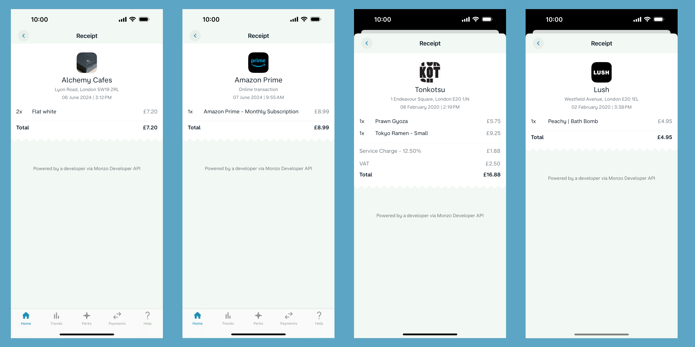
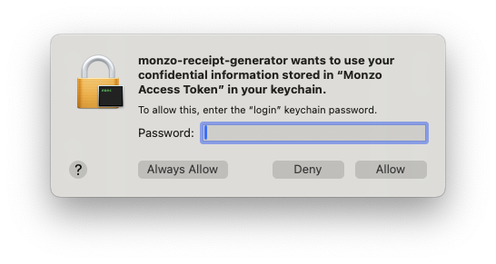

# Monzo Receipt Generator



A third party OAuth client that attaches receipts from a JSON payload to Monzo transcations using the [Monzo Receipts API](https://docs.monzo.com/#receipts) written in Go. Access and refresh tokens are stored within the operating system's keystore system via the [keyring package](https://github.com/99designs/keyring).

## Prerequisites

Before running the program, you'll need to register a new API client on the [Monzo Developer Portal](https://developers.monzo.com). 

To register a new API client, log inot the Monzo Devloper Portal (remember to approve the login via your Monzo app) and click "New OAuth Client".

Then provide the following details for your OAuth client (Logo URL can remain blank):

```
Name: Monzo Receipt Generator
Redirect URL: http://127.0.0.1:21234/callback
Description: Receipt Generator Client Application
Confidentiality: True
```

Once the client is registered you will recieve a Client ID and a Client Secert. Make a note of these!

## How to use
Clone the repository (I like using the [GitHub CLI](https://cli.github.com/) for this)
```bash
gh repo clone skyth3r/monzo-receipt-generator
```

Install dependencies
```bash
go mod tidy
```

Set Client ID and Client Secert in environment variables
```bash
export MONZO_CLIENT_ID=YOUR_CLIENT_ID_HERE

export MONZO_CLIENT_SECRET=YOUR_CLIENT_SECRET_HERE
```

Create a `payload.json` file containing the details of the receipts you want to add to transcations on Monzo account. Refer to the `payload_example.json` file to understand how to structure your receipt data.

Run the program
```bash
go run ./
```

## Expected results

The first time this code is run, the client will start the OAuth flow, and attempt to open a browser with the login URL. On the login page, type in your email address linked to your personal Monzo account and then click the link sent to your email address and go back to the app.

You will then be prompted to open the Monzo app and grant access to the app by clicking "Allow access to your data". This process is related to Strong Customer Authentication. Once access has been granted via the Monzo app, go back to the app and press the [Enter] key to continue.

The app will first load the receipt json data from your `payload.json` file and map it to a slice of Receipt structs. It will then loop through this slice and make the API request to attach each receipt to its corresponding transaction.

For future uses of the app, the access and refresh token will be retrieved from the system's keystore (e.g. on MacOS it woud be retrieved from Keychain). You will be prompted to allow the app to access to the system's keystore. As this access token grants access to your live Monzo bank account I would advice granting access with the 'Allow' option rather than the 'Always Allow' option. 



## Supported accounts

Transactions of the following account types can have receipts added to them:
- Monzo Personal Current Account
- Monzo Joint Current Account
- Monzo Business Account

## Where to find transactions IDs?

Attaching receipts to transactions, require the transaction's ID. There are a few places you can find this transactions ID:
- Via the [developer API endpoint](https://docs.monzo.com/#retrieve-transaction)
- By listing transcations via the [developer portal](https://developers.monzo.com/api)
- Via the Google Sheets export feature (available with [paid Monzo current accounts](https://monzo.com/current-account/plans))
